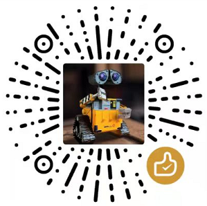

## ROS2

ROS2是用于构建机器人的第二代机器人操作系统（Robot Operating System），其包含了大量的机器人相关软件库和工具集。

## 动手学ROS2教程
小鱼录制和制作的ROS2教程和视频：

- [文字版教程地址](https://fishros.com/d2lros2)

- [视频版教程地址](https://www.bilibili.com/video/BV1gr4y1Q7j5)

## 贡献

我们鼓励您提供任何形式的贡献来帮助我们改进。包括[翻译校准](https://fishros.com)、[贡献文章](https://fishros.com)、[服务器费用支持](https://fishros.com)等。

### 突出贡献成员
- [小鱼](https://github.com/fishros)
- [Alyssa](https://github.com/Alyssa1024)

### 特别感谢
- [zebra-网站建设维护](https://github.com/mzebra)

### 维护费用支持

## 学习资源&交流群

- 微信公众号：

- 微信交流群：公众号下方**鱼群**

- QQ交流群：139707339

